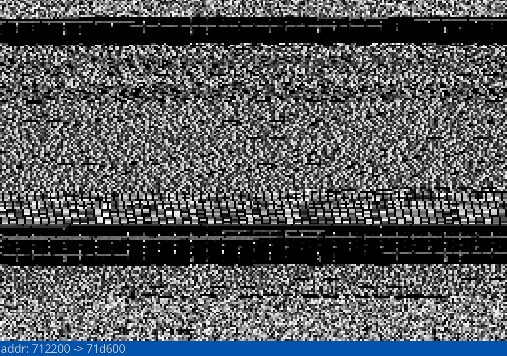

# bv (Binary Visualizer)
Just a simple static binary visualizer.

## Build & Run
1. build `make all`.
2. run `bv [path_to_file]`.

## Controls
- Mouse Wheel, Up/Down Arrow Keys  (Scrolling).
- R (Reset Scroll)

## Preview

