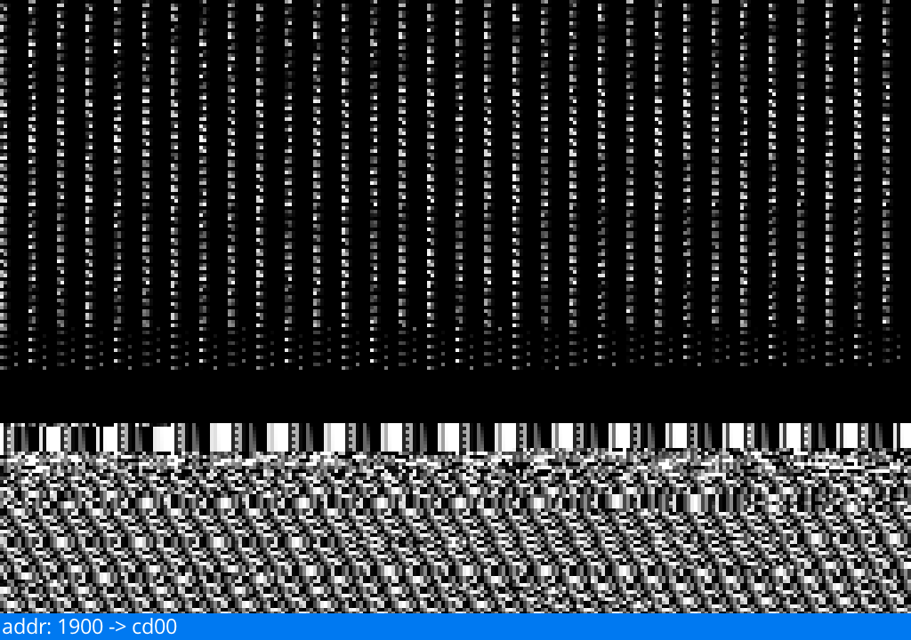

# bv (Binary Visualizer)
Just a tool for visualizing binary data.

## Build & Run
1. build `make all`.
2. run `bv [path_to_file]`.

## Controls
- Mouse Wheel (Scrolling).
- R (Reset Scroll)

## Preview

